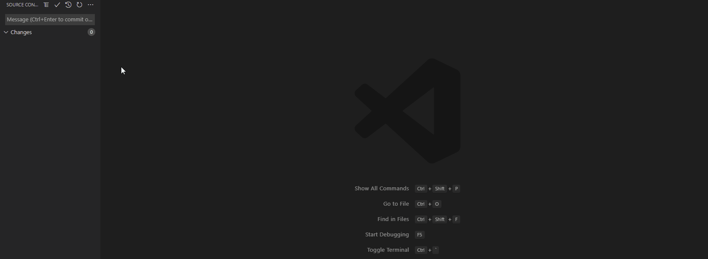

# Git Push Preview

Custom extension for Visual Studio Code. Preview your local commits before pushing to remote. Very similar to IntelliJ Idea's push preview panel.

> Project site: [git-push-preview](https://github.com/dw1284/git-push-preview)

## Installation

Install from vscode marketplace [git-push-preview](https://marketplace.visualstudio.com/items?itemName=dw1284.git-push-preview).

## Usage

New menu entry **Git Push w/preview** is generally available anytime the native Git Push entry is visible:

## Features

- Tree list of your entire commit stack to easily view all file changes
- Easily launch a diff for any file in any commit in the tree

---

**Note:** This project was created for my own convenience. It does what I need it to do, and I do not plan on spending a ton of time on it. It does not handle all branching/merging scenarios, nor does it support all types of changes that can occur to a file. You are welcome to try it and see if it does what you want.